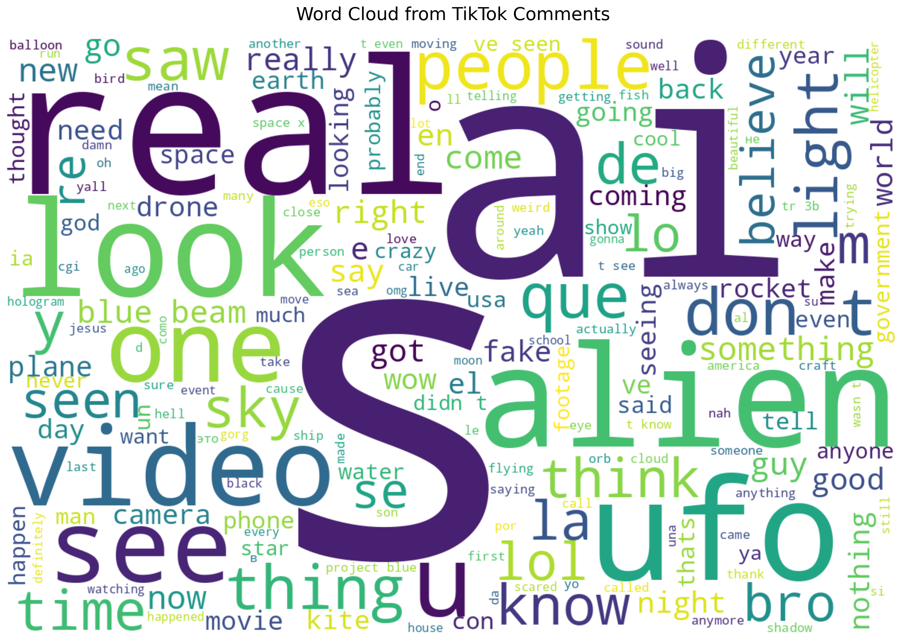
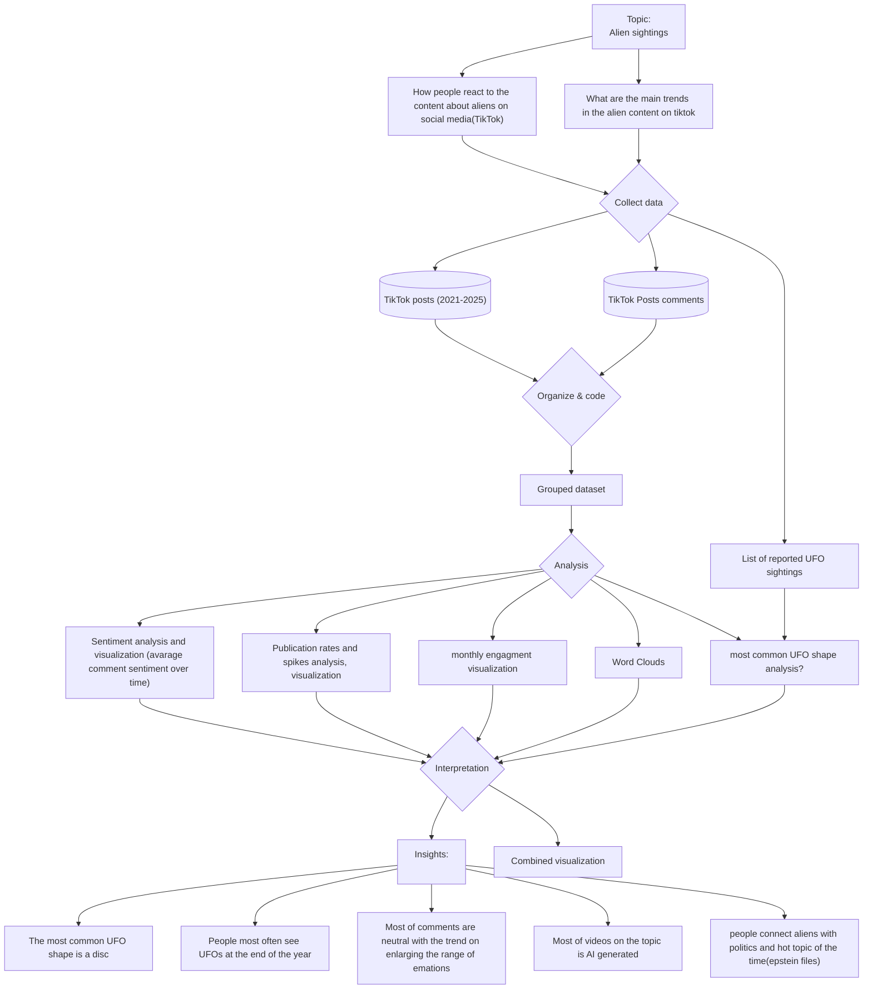

# DDD-2025-Group2
Oleksandra Drapushko, Andrii Ioffe, Maria Mititelu, Isabel Parini

## Human Perception on Alien Related Content

### Abstract
Our project focuses on comments for videos about aliens published on TikTok from September 15, 2020 to November 21, 2025, in order to understand how extraterrestrials and their sightings are perceived by users of this social medium.

Data was scraped with an APIFY tool. The sentiment analysis to evaluate whether a comment was positive, negative, or neutral was also done using an APIFY tool. 

### Protocol Diagram 

### What topic does the project address?
We investigated how aliens are perceived across comments to some videos published on TikTok. 

### What data have you considered?
* Comments on TikTok videos related to aliens published between September 15, 2020 and November 21, 2025.

* An automated sentiment analysis was then used to evaluate the comments to understand wether they were positive, negative, or neutral. 

### Dataset 
[Link to datasets](./DATAALIENS/)

### What does the visualisation show?
* The 10 most relevant videos in terms of engagement; 
* Word clouds in UFO shapes that illustrate the most recurring words in the comments for each video;
* Results of the sentiment analyis showing whether the comments tended to be positive, neutral, or negative; 
* The timeline from 2020 to 2025 shows when the selected videos were posted;
* The spikes indicate the quantity of posts in a certain time period and show an increase after the first half of the current year (2025).
